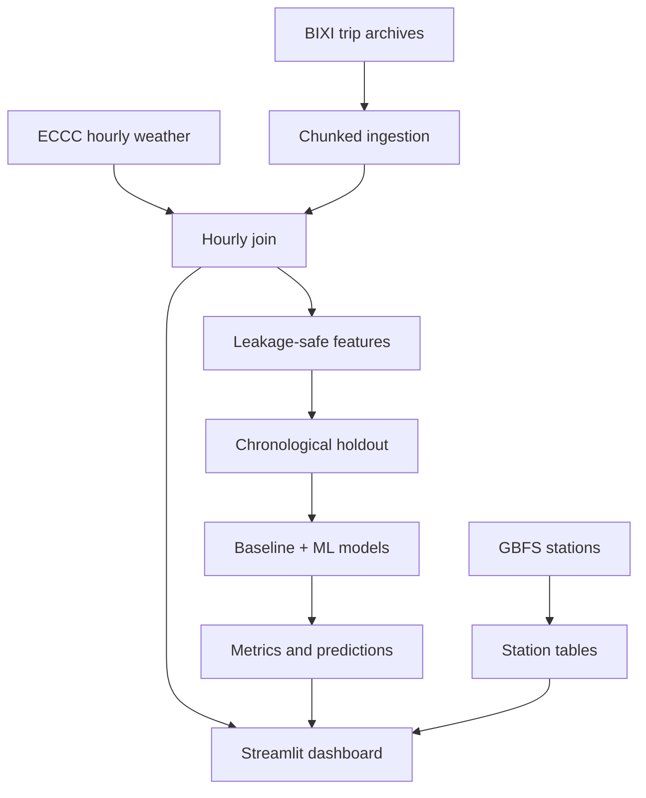

# Montréal BIXI Demand Lab 🚲

An end-to-end data-science project using **14,249,363 official 2025 BIXI trips** to predict hourly departures from
weather, calendar patterns, and past demand. It includes a memory-safe ingestion
pipeline, reproducible feature engineering, chronological validation, two machine-
learning models, a seasonal baseline, SQL analysis, tests, and an interactive
Streamlit dashboard.


## The question

> How accurately can weather, seasonality, and recent ridership predict total
> Montréal BIXI demand for each hour?

This first release forecasts **system-wide demand**. That is statistically sounder
and more useful as a first portfolio version than fitting hundreds of sparse station
models. The pipeline still creates station-level departure tables for mapping and a
future station forecasting extension.

## Real 2025 results

The checked-in processed outputs and fitted model come from the complete official
2025 archive—not synthetic data.

| Model | MAE (trips/hour) | RMSE | WAPE |
|---|---:|---:|---:|
| Same hour one week ago | 369.1 | 714.8 | 47.4% |
| Random forest | 142.0 | 245.5 | 18.3% |
| **Histogram gradient boosting** | **114.3** | **193.3** | **14.7%** |

The gradient-boosting model reduced MAE by **69.0%** relative to the seasonal
baseline on the chronological holdout beginning October 21, 2025. The year's
highest observed hour was June 11 at 5 p.m., with 11,314 departures. The busiest
origin was Métro Mont-Royal (Utilités publiques / Rivard), with 131,809 departures.

These are retrospective test results using observed weather. A live operational
forecast would use forecast weather and should expect some additional error.

## Project highlights

- Official BIXI annual trip archives and live GBFS station metadata
- Hourly Environment and Climate Change Canada weather
- Chunked trip processing for multi-million-row archives
- Leakage-safe 1-hour, 24-hour, and 168-hour lags
- Cyclical time features and Québec statutory holidays
- Chronological 80/20 holdout (never a random time-series split)
- Seasonal-naive, random-forest, and histogram gradient-boosting models
- MAE, RMSE, and WAPE evaluation
- Streamlit dashboard for patterns, weather sensitivity, and predictions
- SQLite/PostgreSQL-compatible loading and example analytical SQL
- Deterministic demo dataset so reviewers can run the project immediately

## Architecture



## Quick start with the included real processed data

```bash
python -m venv .venv
source .venv/bin/activate                 # Windows: .venv\Scripts\activate
pip install -r requirements-dev.txt
make test
make dashboard
```

The packaged project already contains the real processed 2025 tables, trained model,
metrics, and predictions. Open the local URL printed by Streamlit.

To exercise the code quickly with generated data instead, run `make demo`. This will
overwrite the processed outputs locally and is intended only for software testing.

## Run with official 2025 data

The annual trip archive is large. Allow several gigabytes of free disk space.

```bash
make data BIXI_YEAR=2025
make train
python -m src.data.load_sql
make dashboard
```

Individual commands:

```bash
python -m src.data.download --year 2025 --station-id 51157
python -m src.data.build_dataset --year 2025
python -m src.models.train
python -m src.data.load_sql --database-url sqlite:///data/bixi.db
```

`51157` is the configured Montréal-area ECCC station. If its availability changes,
choose an hourly station in the official Historical Climate Data search and pass its
station ID.

## Repository structure

```text
├── app.py                     Streamlit dashboard
├── src/
│   ├── config.py              Paths and verified archive URLs
│   ├── data/
│   │   ├── download.py        BIXI, GBFS, and ECCC downloader
│   │   ├── build_dataset.py   Schema normalization and hourly aggregation
│   │   ├── features.py        Calendar and strictly lagged features
│   │   ├── load_sql.py        Database loader
│   │   └── make_demo.py       Instant reproducible demo data
│   └── models/train.py        Training, selection, and evaluation
├── sql/                       Schema and portfolio-ready queries
├── tests/                     Feature leakage and pipeline tests
├── data/                      Ignored raw/interim/processed artifacts
└── models/                    Ignored trained artifacts and metrics
```

## Feature set

| Group | Variables |
|---|---|
| Calendar | hour, weekday, month, weekend, Québec holiday |
| Cyclical | sine/cosine encodings for hour, weekday, and year |
| Weather | temperature, relative humidity, wind, precipitation |
| Demand history | 1h, 24h, 168h lags; trailing 24h and 168h means |

All rolling features call `shift(1)` before calculating the window. The model cannot
peek at the target hour or any future hour.

## Evaluation design

The earliest 80% of rows train the models; the latest 20% form the untouched test
period. The one-week seasonal baseline predicts each hour using demand at that same
hour seven days earlier. A machine-learning model is useful only if it improves on
that strong, understandable baseline.

- **MAE:** typical absolute error in trips per hour
- **RMSE:** penalizes occasional large misses
- **WAPE:** absolute error relative to total observed volume

The reported table above uses the official full-year data. `make demo` deliberately
overwrites it with synthetic outputs, whose metrics must not be presented as findings.

## Data ethics and limitations

- Completed trips are not identical to latent demand. Empty stations and full docks
  create censored demand.
- Rebalancing, station downtime, major events, construction, and transit disruption
  are not represented in the base feature set.
- A real future forecast needs forecast weather; observed test-period weather gives
  an upper-bound-style retrospective evaluation.
- The model predicts aggregate trip counts, not individual behaviour, and uses no
  personally identifying data.
- Confirm the source terms before redistributing raw data. This repository ignores
  downloaded archives and derived datasets by default.

## Strong next extensions

1. Add event and transit-disruption features.
2. Forecast the top 20 stations with global station embeddings or station IDs.
3. Predict arrivals and departures separately to estimate dock imbalance.
4. Use rolling-origin cross-validation and prediction intervals.
5. Deploy the dashboard and schedule monthly retraining.

## Data sources

- [BIXI Montréal Open Data](https://bixi.com/en/open-data/) — annual trip history and live GBFS feed
- [Environment and Climate Change Canada Historical Data](https://climate.weather.gc.ca/historical_data/search_historic_data_e.html) — hourly weather
